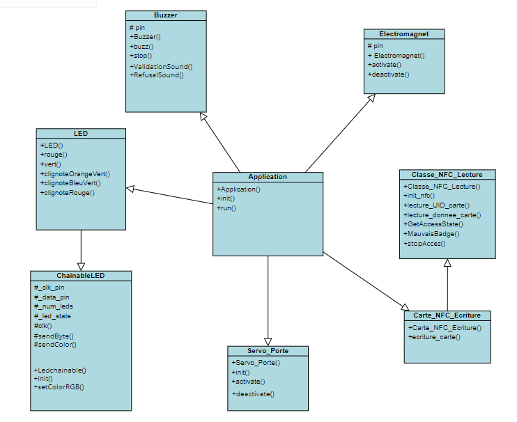

# Ouverture de porte automatisée avec reconnaissance RFID

Notre projet a pour but d'ouvrir une porte grâce à la reconnaissance d'un badge RFID. 

## Eléments utilisés

Nous avons utilisé pour ce projet :
- Une carte Arduino ESP8266
- Un récepteur RFID (acheté sur AliExpress)
- Un électroaimant (Electromagnet v1.1)
- Une LED RGB (Grove Chainable RGB LED v2.0)
- Un buzzer (Buzzer v1.2)
- Un servomoteur
- Une porte fabriquée par nos soins (dimensions : 10cmx20cm)

## Conception

### Diagramme de classes :

## Déroulement du projet

Pour la conception de notre projet, nous nous sommes d'abord intéressés à l'élément principal de notre montage, le capteur RFID. Durant les premières séances, nous avons essayé de faire fonctionner le capteur RFID fourni par l'INSA, le Grove NFC v1.1 de chez SEEED.  
Malheureusement, après beaucoup d'efforts et d'échanges avec les professeurs encadrants, nous n'avons pas réussi à faire marcher le capteur. Ce n'est qu'après la dernière séance de BE qu'un camarade d'un autre groupe de TP nous a donné un nouveau capteur RFID (RFID-RC522), qu'il avait commandé sur AliExpress se retrouvant dans la même impasse que nous.  
Pendant ce temps, nous nous sommes alors concentrés sur les autres éléments de notre projet : la LED, le buzzer, l'électroaiment et le servomoteur.   
Pour la LED RGB, nous avons fait une classe "LED" héritée de la classe "ChainableLED", avec des méthodes simples pour faire clignoter la LED en vert et bleu lorque le badge présenté est valide, ou en rouge quand il ne l'est pas. nous avons aussi créé des méthodes plus simples avec des allumages de différentes couleurs.  
Pour le buzzer, nous avons créé une classe avec des méthodes permettant de réaliser une mélodie différente en fonction de la validation du badge ou non, et une méthode qui permet de stopper le son émis.  
Concernant l'électroaimant, nous n'avons pas réussi à le faire marcher mais nous avons quand même implémenté sa classe car nous l'avions écrite.
Pour le servomoteur, nous avons créé une classe avec les méthodes associées : 
- une pour l'initialiser en mode bloquage de porte
- une pour l'activer, pivoter de 180° et donc débloquer la porte
- une dernière pour le désactiver, pivoter de 180° en sens inverse et rebloquer la porte.    

Nous avons pu compter sur Maxime qui a réalisé chez lui une porte en bois avec deux charnières plastiques.  
Quant à l'élément principal, le capteur RFID, nous avons finalement réussi à le coder en utilisant des fichiers .h déjà existants : Arduino.h, SPI.h, MRFC522.h et stdint.h. Nous avons créé d'abord une classe mère "Classe_NFC_Lecture", qui nous permet de lire l'UID du badge (=son identifiant) et les données contenues dessus. Nous avons ensuite une méthode qui permet de comparer les octets de l'UID du badge avec ceux du capteur.   
Aussi, nous avons la classe héritée ""Classe_NFC_Ecriture", qui permet non pas de modifier l'UID du badge NFC, mais d'écrire des données dessus comme le nom et les coordonnées du propriétaire du badge.

Nous avons enfin joint nos différents morceaux de code en créant le GitHub. Nous avons finalisé le côté matériel du projet en réalisant les branchements, en fixant les différents éléments à la porte et en effectuant de nombreux tests.

## Comment faire marcher le système?

Pour faire marcher notre système, nous disposons de deux badges RFID différents : un mauvais et un bon.  
Lorsque la carte est alimentée, nous allons alors passer devant le capteur un premier badge, le mauvais par exemple. Nous allons observer un actionnement de la LED et du Buzzer. Ensuite, nous allons passer le second badge et nous allons voir cette fois-ci un actionnement de la LED, du Buzzer et du Servomoteur.  
Ce dernier va alors pivoter et libérer la porte, permettant l'entrée. Quelques secondes plus tard, le système se referme et se remet en attente de lecture d'un badge.

## Contributing

Thanks to @ValCourt40 and @Thornary for this project

Please make sure to update tests as appropriate.
