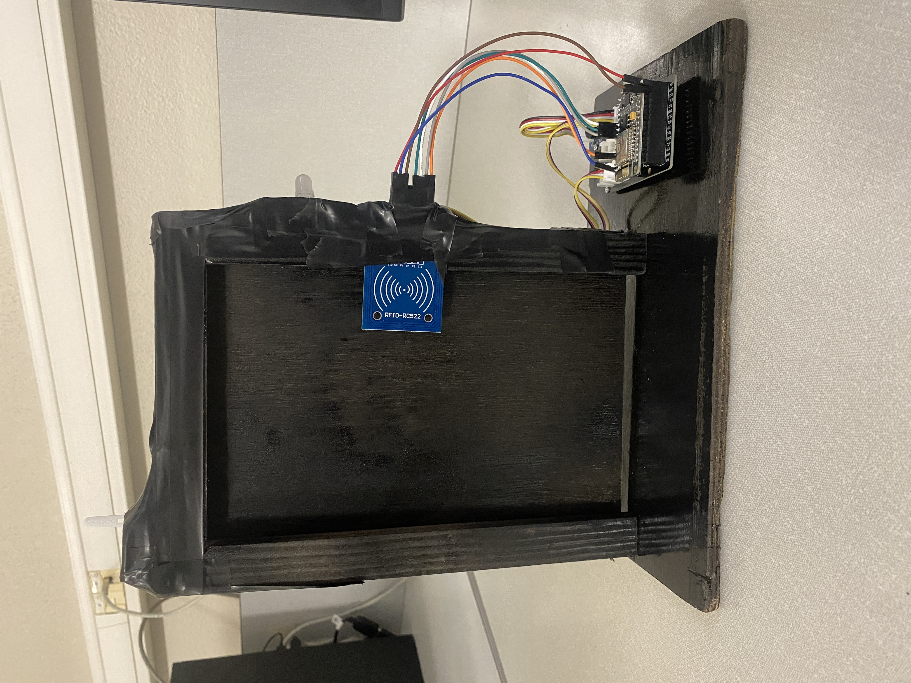

# Ouverture de porte automatisée avec reconnaissance RFID

Notre projet a pour but d'ouvrir une porte grâce à la reconnaissance d'un badge RFID. 

## Comment compiler et exécuter notre programme?

Il faut télécharger le main.ino, ainsi que tous les fichiers Include et Source dans un même dossier sur son ordinateur. Vous pourrez ensuite ouvrir le projet sur l'IDE Arduino via le main.ino. Enfin, il faut téléverser le programme sur la carte et lancer le test.
