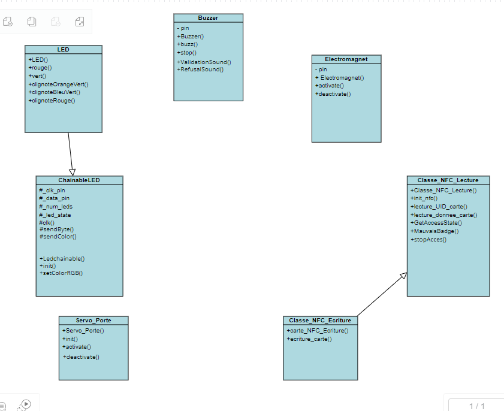

# Ouverture de porte automatisée avec reconnaissance RFID

Notre projet a pour but d'ouvrir une porte grâce à la reconnaissance d'un badge RFID. 

## Eléments utilisés

Nous avons utilisé pour ce projet :
- Une carte Arduino ESP8266
- Un récepteur RFID (acheté sur AliExpress)
- Un électroaimant (Electromagnet v1.1)
- Une LED RGB (Grove Chainable RGB LED v2.0)
- Un buzzer (Buzzer v1.2)
- Un servomoteur
- Une porte fabriquée par nos soins (dimensions : 10cmx20cm)

## Conception

### Diagramme de classes :

## Déroulement du projet

Pour la conception de notre projet, nous nous sommes d'abord intéressés à l'élément principal de notre montage, le capteur RFID. Durant les premières séances, nous avons essayé de faire fonctionner le capteur RFID fourni par l'INSA, le Grove NFC v1.1 de chez SEEED.  
Malheureusement, après beaucoup d'efforts et d'échanges avec les professeurs encadrants, nous n'avons pas réussi à faire marcher le capteur. Ce n'est qu'après la dernière séance de BE qu'un camarade d'un autre groupe de TP nous a donné un nouveau capteur RFID (RFID-RC522), qu'il avait commandé sur AliExpress se retrouvant dans la même impasse que nous.  
Pendant ce temps, nous nous sommes alors concentrés sur les autres éléments de notre projet : la LED, le buzzer, l'électroaiment et le servomoteur.   
Pour la LED RGB, nous avons fait une classe "LED" héritée de la classe "ChainableLED", avec des méthodes simples pour faire clignoter la LED en vert et bleu lorque le badge présenté est valide, ou en rouge quand il ne l'est pas. nous avons aussi créé des méthodes plus simples avec des allumages de différentes couleurs.  
Pour le buzzer, nous avons créé une classe   
Pour l'électroaimant,   
Pour le servomoteur, nous avons créé une classe avec les méthodes associées : une pour l'initialiser; une pour l'activer, pivoter de 180° et donc débloquer la porte; et une dernière pour le désactiver, pivoter de 180° en sens inverse et rebloquer la porte.  
Nous avons pu compter sur Maxime qui a réalisé chez lui une porte en bois avec deux charnières plastiques.  
Quant à l'élément principal, le capteur RFID, nous avons finalement réussi à le coder 

## Contributing

Thanks to @ValCourt40 and @Thornary for this project

Please make sure to update tests as appropriate.
